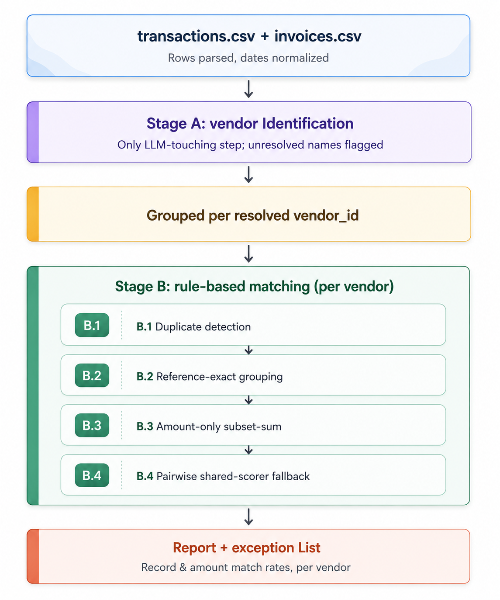

# Finance Reconciliation Agent

A two-stage reconciliation pipeline: one scoped LLM call resolves vendor
identity (merging raw name variants like "AWS" / "Amazon Web Services
Inc."); everything after that — matching, allocation, exceptions — is
deterministic, rule-based code. No amount, match, or allocation decision is
ever made by a model.

Live Deployed :  https://financereconciliationagent.vercel.app/


---

## Architecture

| File | Role |
|---|---|
| `pipeline.py` | Orchestrates the two stages end to end |
| `vendor_resolution.py` | Stage A — vendor name resolution (LLM call or offline heuristic fallback) |
| `reconciliation.py`, `scoring.py` | Stage B — deterministic matching, allocation, scoring |
| `report.py`, `utils.py`, `config.py` | Reporting and shared helpers |
| `app.py` | FastAPI backend exposing `/api/health` and `/api/reconcile` |
| `run_agent.py` | CLI entry point (`python3 run_agent.py transactions.csv invoices.csv`) |
| `frontend/index.html` | Self-contained dashboard, no build step |
| `frontend/vercel.json` | Proxies `/api/*` from the Vercel domain to the Render backend |

Deployment split: **backend on Render**, **frontend on Vercel** (static
file + proxy, not a Next.js app).

---


---

## Deploying

**Backend (Render):** connect the repo, build command
`pip install -r requirements.txt`, start command
`uvicorn app:app --host 0.0.0.0 --port $PORT` (or just let it read
`render.yaml`). Set `GROQ_API_KEY` if Online mode is needed.

**Frontend (Vercel):** deploy the `frontend/` folder as the project root.
Before deploying, edit `frontend/vercel.json` and replace the placeholder
with the actual Render URL.

---

**Sample test data** 

`transactions.csv`
```csv
txn_id,txn_date,raw_vendor_name,amount,reference
T1,2024-01-05,Amazon Web Services,15000,INV-1001
T2,2024-01-06,AWS,4200,INV-1002
T3,2024-01-10,ABC Ltd,9000,INV-2001
T4,2024-01-12,Google Cloud,3000,INV-3001
```

`invoices.csv`
```csv
invoice_id,invoice_date,raw_vendor_name,amount,reference
I1,2024-01-04,Amazon Web Services Inc.,15000,INV-1001
I2,2024-01-06,Amazon Web Services Inc.,4200,INV-1002
I3,2024-01-09,ABC Trading Ltd,9000,INV-2001
I4,2024-01-11,Google Cloud Platform,3000,INV-3001
```

Expected outcome: "AWS" and "Amazon Web Services Inc." merge automatically,
"Google Cloud" and "Google Cloud Platform" merge automatically, and "ABC
Ltd" / "ABC Trading Ltd" are flagged into `needs_review_groups` rather than
auto-merged (the similarity between those two names is more ambiguous by
design of the matching threshold).

---

